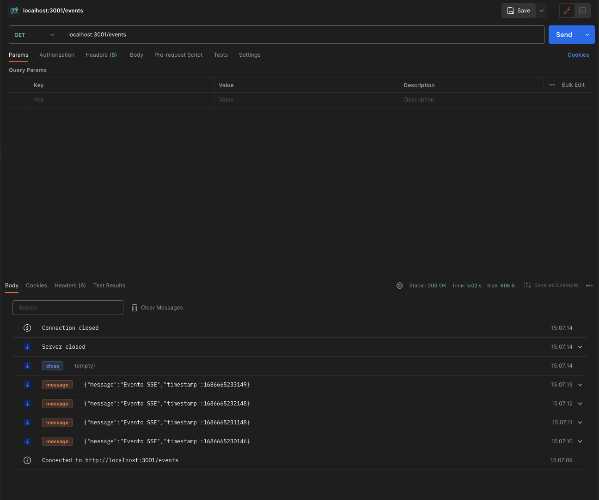
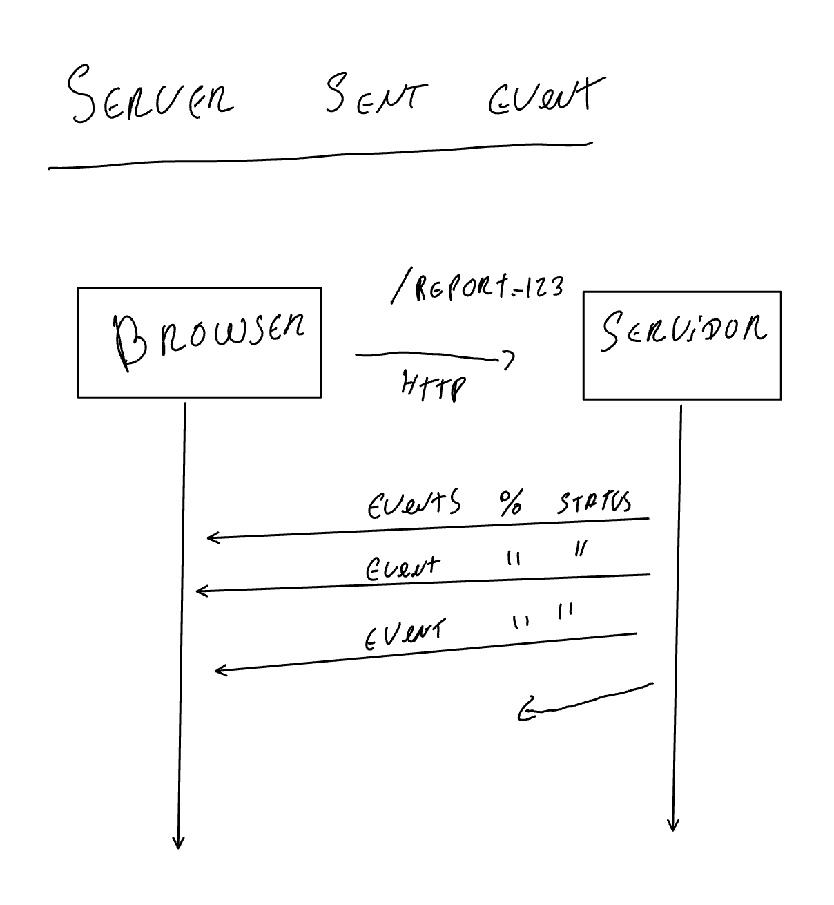

# Project Name: Server Sent Event Implementation with Express and NestJS

## Description
This project provides a step-by-step guide on how to implement a simple Server Sent Event (SSE) using two popular Node.js frameworks: Express and NestJS. SSE is a technology that enables a server to push real-time updates to the client, allowing for a bi-directional communication channel over a single HTTP connection.

SSE is a alternative for websocket, but it works only in one way, the server can send messages to the client, but the client can't send messages to the server.

### Websocket


### Server Sent Event



## Explanation

First, i created the express simple example to check the SSE implementation, then i created the nestjs example to check the SSE implementation.


## Getting Started
Follow the steps below to set up and run the project:

1. Clone the repository:

```bash
git clone https://github.com/AlexcastroDev/server-sent-event-nestjs
```

2. Change into the project directory:

```bash
cd express
```

or 

```bash
cd nestjs
```

3. Install the dependencies:

```bash
npm install
```